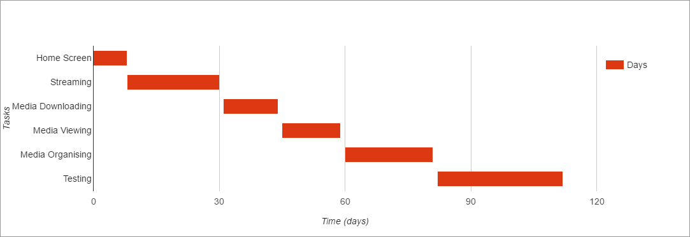
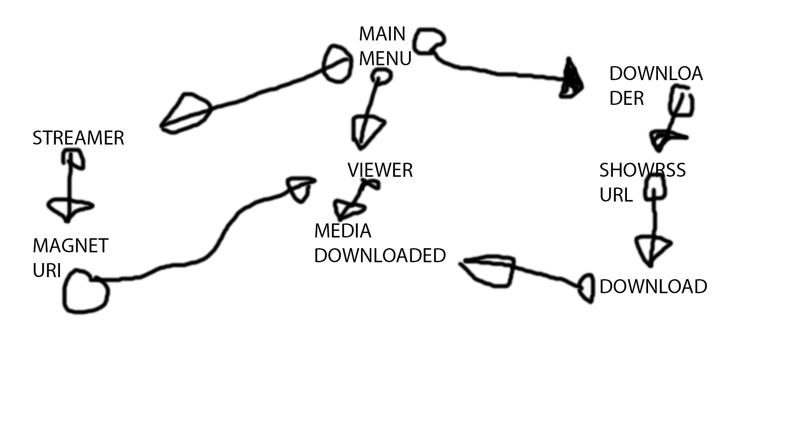

# Media Mate - A Proper Media Centre.

# The Problem
The problem currently with media centres is that to make one, you need to go through all sorts of setup, which is time consuming and mentally draining.

Another big problem with media centres, is that you need to have many programs running at the same time, wasting precious system resources.

To give you an example of what I mean - I have a media centre myself. I have to use [Sonarr](https://sonarr.tv), [Plex](https://plex.tv), [Transmission](https://transmissionbt.com) and [Couchpotato](https://couchpota.to/) for what seems like a simple job.

With such a large amount of information from so many sources, it becomes difficult to keep on top of it all.

Leisure time should be, as the name suggests, easy. I aim to provide a solution to this information overload with a focus on the particular area of media (TV, movies, music etc).

# Why I chose this problem
I chose this problem because it is one that has plagued me for many years. I used to work around it by using a virtual machine, and only booting it when I needed to. This is very inefficient, as you have to think about it constantly, wondering if there is something to download / watch.

Instead of having to run 5 different programs, why not run one that does everything those 5 programs which I mentioned earlier do. The result will be an well organised, easy to set up media centre.

# Why is a software solution appropriate for this problem?
A software solution is appropriate for this problem because it is something that should be automated, and you should be able to just click a button, and then get the thing you wanted. You should not have to watch for new releases yourself, download them manually, import them manually, and then finally watch them. You should be able to open up the program, and see all your media right there. And since all of this comes from the internet, it has to be utilised by some sort of software in the first place.

# What software development approach?
I will be using a combination of rapid application development and agile. I will be using this combination because of a few reasons. One reason is that some of the required utilities already exist in my chosen language. Another reason for using agile is that if something doesn't work, I can just change what doesn't work.

# What will the final solution do?
The final solution will be an [Electron](https://electron.atom.io) app that you can open up, and on first run, it will ask you for a [ShowRSS](http://showrss.info/) feed URI, which will be used to monitor and download new TV shows as they come out, without you having to even think about it.

You will also be able to stream media directly from a magnet URI, such as movies or the like. It will also serve as the viewer for your downloaded media. You will be able to choose where your media will be stored. You will be able to monitor a downloads progress, initiate a manual download, or cancel / restart any download.

The program will also organise and name your media according to how you want it. It will categorise your media by  series, and you will be able to sort it however you would like.

Another thing it will do is a background service, and native OS integration.

# Event Driven or Sequential?
My solution will be a mixture of both, the front end will be event driven, whereas the backend (downloading etc) will be sequential.

# Programming Environment
I will be using [WebStorm](https://www.jetbrains.com/webstorm/) for writing the code, [Electron](https://electron.atom.io) for the app itself, and [NodeJS](https://nodejs.org) as the language.

# Skills I currently have
Currently, I have very good knowledge in Electron and NodeJS which I will be using, experience with WebStorm, and many years of coding and command line experience.

# Skills I may need to acquire
At the moment, there is no skills I'll need but don't already have, but I will be brushing up my skills with Electron, since I don't have as much experience as I have with NodeJS.

# Interaction
The user will interact with the program by interacting with UI elements such as buttons, links, video controls, etc. Below is a UI draft of the start page.

# Backup procedures
I will be using [Git](https://git-scm.com/) and [GitHub](https://github.com) for the source code and make regular 'commits' and pushes.

# Legal issues
I will have to have a disclaimer, that I am not responsible for anything that is done with the program, as it could potentially be used for illegal purposes.

# Social issues
There are potential social issues with spending more time at the computer, but I think the opposite effect will happen, as there is far less set up and preamble involved.

# Ethical issues
There are no ethical issues with this project.

# Gantt Chart

# Structure Chart

# IPO Chart
| Input        	| Processing                                          	| Output           	|
|--------------	|-----------------------------------------------------	|------------------	|
| Magnet URI   	| Download                                            	| Display Video    	|
| ShowRSS Feed 	| Get RSS feed, process, download, sort, rename, move 	| Files downloaded 	|