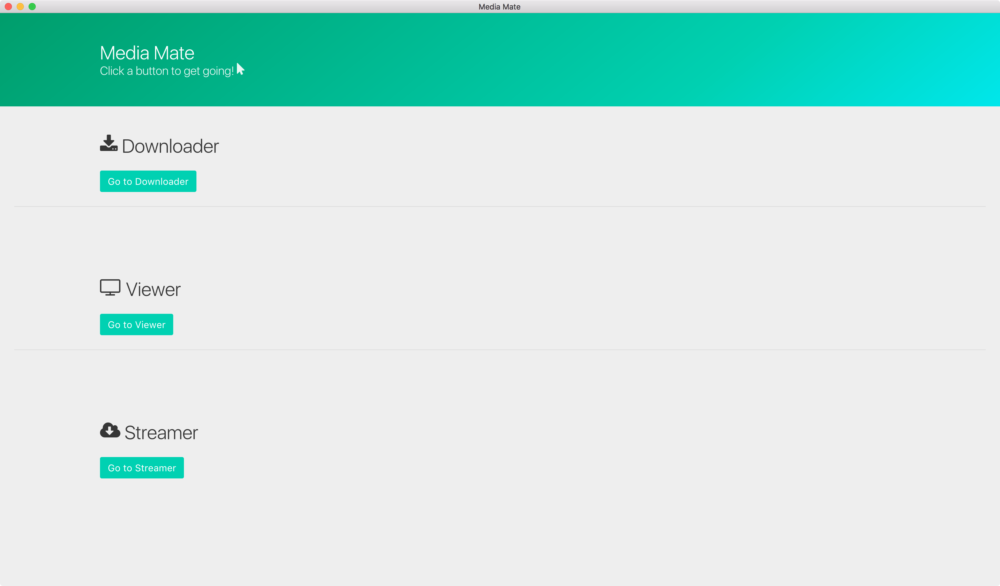

# Media Mate
> A full media server/player/downloader - in one program

<!-- MarkdownTOC -->

- [What is it?](#what-is-it)
- [Whats it look like then?](#whats-it-look-like-then)
- [License](#license)

<!-- /MarkdownTOC -->

## What is it?

Media Mate is a media centre, along the lines of [Plex](https://plex.tv), with the features of [Sonarr](https://sonarr.tv), downloading and organising your media in a good looking way. Media Mate also allows you to automatically download the shows that *you* want to watch, thanks to [ShowRSS](http://showrss.info/).

## Whats it look like then?

## License

MIT © [Willyb321](https://tehsuperwilly.tech)
